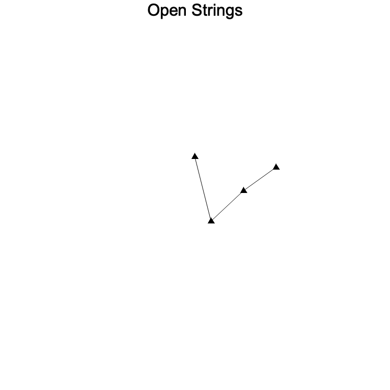
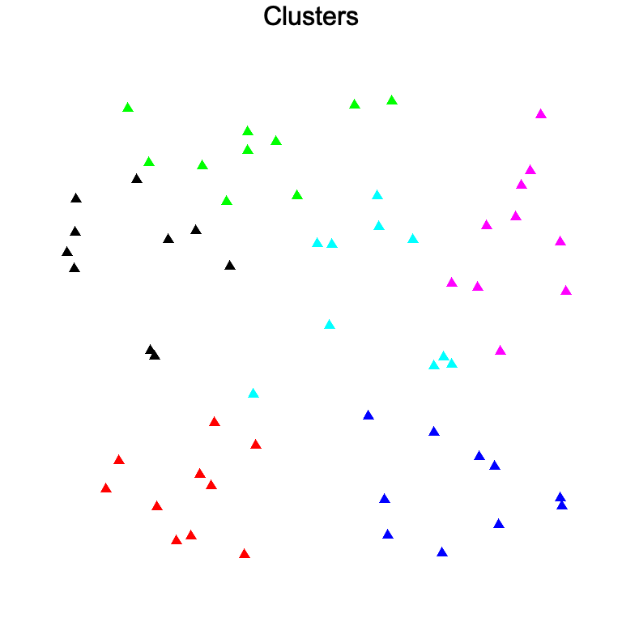
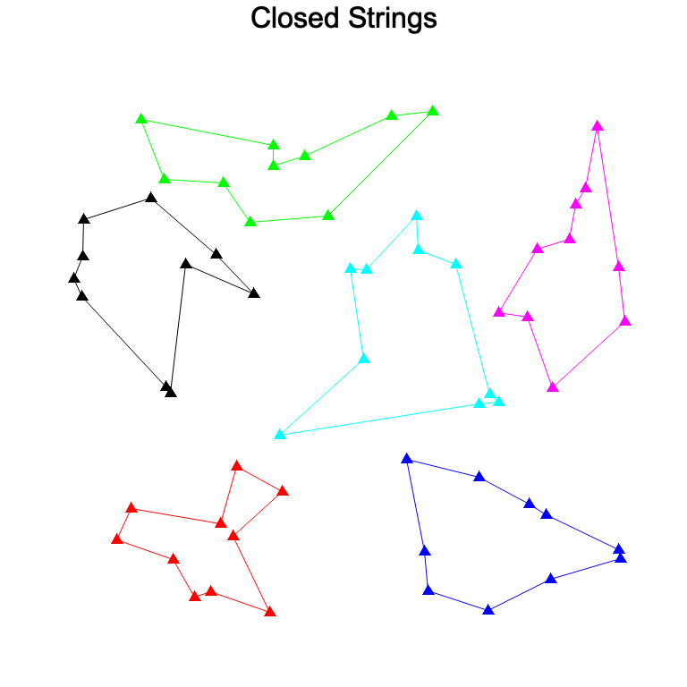
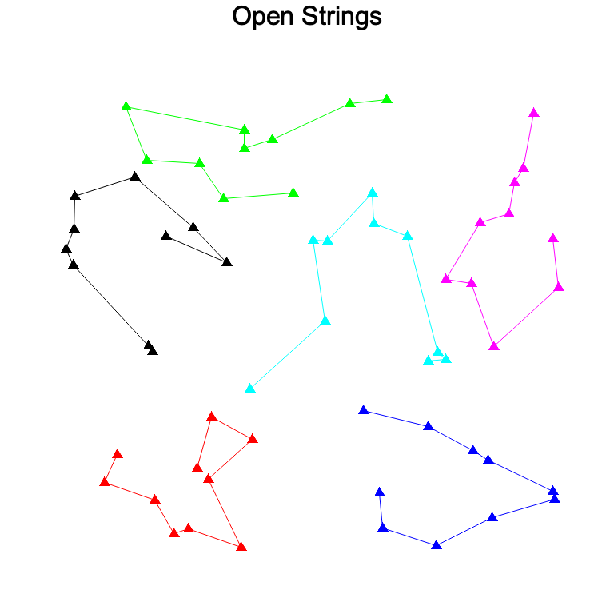

# Multiple Traveling Salesmen with Capacities
## Statement of the Problem
Given $n$ cities and $k$ salesmen, each needing to visit exactly $n_1, ..., n_k$ cities (where $n_1 + ... + n_k = n$) and returning to the original city, what is the minimal distance traveled in total?

## Example
Suppose we have 6 cities and 2 salesmen, each needing to visit 3 cities. Make sure the directory `./images/example_0/` exists.

    use salesman::string::get_string_order;
    use salesman::plot::plot_strings;

    let points = vec![(-0.5, -0.5), (-0.6, -0.5), (-0.6, -0.4), (0.5, 0.5), (0.6, 0.5), (0.6, 0.6)];
    let salesmen_capacities = vec![3, 3];
    let intensity = 10.0;
    let seed = Some(42);
    let order = get_string_order(&points, &salesmen_capacities, intensity, seed);
    assert!(&order[0..3] == &vec![0, 1, 2] || &order[0..3] == &vec![2, 1, 0]);
    assert!(&order[3..6] == &vec![3, 4, 5] || &order[3..6] == &vec![5, 4, 3]);

    // Now save image to png.
    plot_strings(
        &points,
        &order,
        &salesmen_capacities,
        false,
        true,
        "example_0/open_strings",
        "Open Strings",
    );

This will create an image file `./images/example_0/open_strings.png` which should look like the following.

## One Traveling Salesman
We use the _simulated annealing algorithm_ to achieve this. Represent the salesman's journey by a mutable vector of cities of length $n$. In simulated annealing, we swap city $i$ and $j$ and check whether this gives a shorter distance. If it is shorter, we approve it, and if it is longer, we still approve it with a certain probability (controlled by a variable called temperature) which decreases exponentially as the algorithm proceeds. We eventually terminate the algorithm when the temperature drops below a certain threshold.

## Multiple Salesmen
We represent the solution by a mutable vector of cities of length $n$. The first $n_1$ entries represent the first salesman's journey, the next $n_2$ entries represent the second salesman's journey and so on. 

I tried to modify the simulated annealing algorithm for the single traveling salesman by changing the distance function. However, this was not successful. Therefore, I decided to first cluster the cities. 

The clustering algorithm can also use simulated annealing. The _cluster metric_ is 
$$\mathcal{M}(C_1, C_2,...,C_k) = \sum_{i=1}^k \sum_{\mathbf{x}_j \in C_i} \lVert \mathbf{x}_j - \mathbf{z}_i \rVert$$ 

where 
$$
{\mathbf{z}}i = \frac{1}{|C_i|} 
\sum_{\mathbf{x} \in C_i} \mathbf{x}
$$

is the barycenter of cluster $i$. See this [article](http://library.isical.ac.in:8080/jspui/bitstream/10263/5650/1/Clustering%20using%20simulated%20annealing%20with%20probabilistic%20redistribution-IJOPRAAI-15-2-2001-%20p%20269-285.pdf).

We then run the salesman algorithm on each cluster.

If we don't require the salesmen to return to the original position, a good enough solution would be to remove the longest path 

